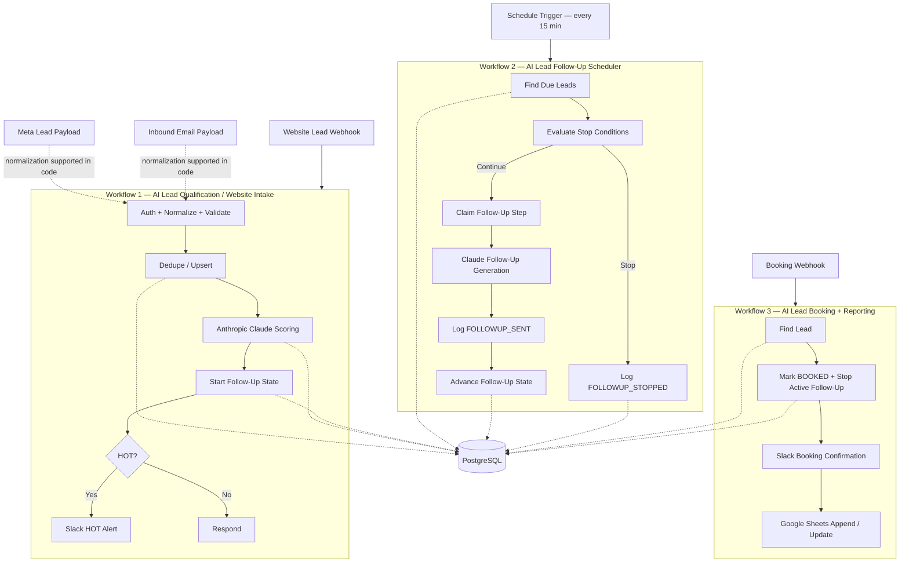

# 🚀 AI Lead Qualification & Follow-Up Automation

Production-style AI lead qualification and follow-up automation built with **n8n, PostgreSQL, Anthropic Claude, Slack, and Google Sheets**.

The system receives and validates leads, deduplicates them safely at the database layer, scores them with Claude, assigns a deterministic temperature, starts a database-backed follow-up sequence, handles replies and bookings, sends high-value alerts to Slack, and synchronizes confirmed bookings to Google Sheets.

The project is complete through its full M0–M9 milestone plan.

## Final verification

- **668 automated tests**
- **667 passing**
- **1 expected skip**
- **0 failing**
- Three working n8n workflows
- Real Anthropic Claude scoring verified
- Real Slack HOT-lead alert verified
- Real booking Slack confirmation verified
- Real Google Sheets booking sync verified
- Scheduler advancement and stop conditions verified against live PostgreSQL
- Duplicate booking and notification idempotency verified
- Authentication, validation, human-review, booking, reply-stop, and 404/401 failure paths verified

---

## Tech stack

| Layer | Current project |
| --- | --- |
| Workflow automation | n8n, self-hosted with Docker |
| Database | PostgreSQL |
| Verified live LLM | Anthropic Claude |
| Local / $0 LLM option | Ollama + `qwen2.5:7b-instruct` |
| Alerts | Slack Incoming Webhook |
| Reporting | Google Sheets via n8n OAuth2 |
| Tests | Node.js built-in `node:test` |
| Runtime safety | `DRY_RUN`, DB constraints, bounded retries, audit events |
| Business timezone | `America/Los_Angeles` in the verified demo |

### About the $0 option

The architecture was designed with a **$0-capable local path**:

- local n8n
- local PostgreSQL
- Ollama
- `qwen2.5:7b-instruct`
- `DRY_RUN=true`

That is not the same thing as saying the verified live demo used no paid API.

The final live scoring and follow-up-generation tests were performed with **Anthropic Claude**. Ollama/Qwen remains the local fallback / zero-cost configuration supported by the project.

---

# Architecture



## Source support vs. live wiring

The normalization layer supports three payload types:

- website
- Meta lead ads
- inbound email

The **live n8n intake canvas currently uses the website webhook**.

Meta and email payload normalization are implemented and tested in the codebase, but separate live Meta/email trigger integrations were not built as part of the final demo.

---

# The three live n8n workflows

| # | Workflow | Trigger | Purpose |
| --- | --- | --- | --- |
| 1 | **AI Lead Qualification — Website Intake** | Webhook | Authentication, validation, dedupe, Claude scoring, follow-up initialization, HOT Slack alerts |
| 2 | **AI Lead Follow-Up Scheduler** | Every 15 minutes | Finds due leads, evaluates stop conditions, generates follow-up copy, logs the send, advances state |
| 3 | **AI Lead Booking + Reporting** | Booking webhook | Marks leads booked, cancels active follow-ups, sends booking confirmation, updates Google Sheets |

Detailed node-by-node guides:

- `docs/workflow.md`
- `docs/scheduler.md`
- `docs/booking.md`
- `docs/security.md`

---

# Workflow 1 — Intake & AI Scoring

The website intake workflow:

1. receives a webhook
2. validates the shared secret
3. normalizes and validates the payload
4. builds the dedupe identity
5. safely upserts the lead into PostgreSQL
6. logs CRM/audit events
7. builds a sanitized scoring prompt
8. calls Anthropic Claude
9. validates the returned score
10. retries malformed model output once using a stricter prompt
11. assigns `HOT`, `WARM`, or `COLD` deterministically
12. initializes follow-up state
13. sends a Slack alert for HOT leads when `DRY_RUN=false`

### Temperature is deterministic

Claude returns the score and reasoning.

Claude does **not** decide whether a lead is HOT, WARM, or COLD.

That mapping is performed deterministically by:

```text
src/core/temperature.js
```

This avoids contradictions such as:

```text
score: 30
temperature: HOT
```

---

# Workflow 2 — Follow-Up Scheduler

The scheduler runs every 15 minutes and queries PostgreSQL for leads whose:

```text
followup_status = IN_PROGRESS
next_followup_at <= now()
```

It then:

- evaluates reply / booking / CRM stop conditions
- claims the follow-up step idempotently
- builds a sanitized follow-up prompt
- generates the follow-up copy using Claude
- records `FOLLOWUP_SENT`
- advances `followup_step`
- updates `last_contacted_at`
- calculates the next allowed business-time send
- or records `FOLLOWUP_STOPPED`

### Important current-demo boundary

The scheduler currently **generates and records the follow-up message**, but the demo does not contain a real email/SMS delivery provider.

`FOLLOWUP_SENT` therefore represents the scheduler's audited send step in this portfolio implementation.

Adding an actual email/SMS provider would be an integration-layer extension rather than a change to the scheduling/state machine itself.

---

# Why there is no n8n Wait node

Follow-up state lives in PostgreSQL:

```text
followup_status
followup_step
next_followup_at
last_contacted_at
```

The scheduler polls explicit database state instead of keeping one long-running n8n execution open for every lead.

This makes follow-up state:

- queryable
- auditable
- restart-friendly
- easy to debug
- independent of one long-lived workflow execution

---

# Workflow 3 — Booking & Reporting

The booking webhook:

1. authenticates the request
2. resolves the lead
3. marks:
   - `booking_status = BOOKED`
   - `crm_status = BOOKED`
4. stops the follow-up sequence only when it was actually `IN_PROGRESS`
5. clears `next_followup_at`
6. logs `BOOKING_RECEIVED`
7. logs `FOLLOWUP_STOPPED` when a sequence was actually stopped
8. idempotently claims the booking confirmation
9. sends a Slack confirmation when `DRY_RUN=false`
10. appends or updates the booking row in Google Sheets

The live booking flow was verified with both:

```text
DRY_RUN=true
```

and:

```text
DRY_RUN=false
```

The non-dry-run test produced both:

```text
SLACK_ALERT_SENT = SUCCESS
SHEET_SYNCED      = SUCCESS
```

---

# PostgreSQL state & idempotency

The database, not workflow timing, enforces the important duplicate guarantees.

## Lead dedupe

```text
leads.dedupe_key UNIQUE
```

Repeated submissions cannot create duplicate lead rows.

## Notification claims

```text
notifications (lead_id, kind, step) UNIQUE
```

This protects:

- `SLACK_HOT`
- `FOLLOWUP`
- `BOOKING_CONFIRM`

from duplicate claims.

The booking acceptance test confirmed that a repeated identical booking POST:

- logged a second `BOOKING_RECEIVED`
- did **not** create a second `FOLLOWUP_STOPPED`
- did **not** send a duplicate booking Slack notification

## Audit log

`lead_events` is append-only application history.

Examples include:

```text
CRM_CREATED
AI_SCORE_CREATED
AI_SCORE_INVALID
FOLLOWUP_SENT
FOLLOWUP_STOPPED
BOOKING_RECEIVED
SLACK_ALERT_SENT
SHEET_SYNCED
WORKFLOW_ERROR
```

This makes workflow behavior inspectable directly from PostgreSQL rather than relying only on the n8n UI.

---

# Anthropic Claude and local Ollama

## Verified live provider

The completed demo uses:

```text
Anthropic Claude
```

for live scoring and follow-up generation.

The live n8n canvas uses Anthropic HTTP Request nodes.

## Local fallback / $0 path

The source adapter layer also supports:

```text
LLM_PROVIDER=ollama
OLLAMA_MODEL=qwen2.5:7b-instruct
```

This allows local experimentation without a paid LLM API.

OpenAI adapter support also exists in the source adapter layer.

### Important distinction

Provider abstraction in `src/adapters/llm/` is tested in code.

The final live n8n canvases themselves are currently configured specifically for **Anthropic Claude**.

Changing the live canvas to another provider may require provider-specific HTTP Request configuration; it should not be described as a guaranteed environment-variable-only switch in the current live canvas.

---

# Ollama hardware guidance

`qwen2.5:7b-instruct` is approximately a 7B-parameter local model.

Typical development guidance:

- CPU-only machines can run it, but responses may be slow
- 16 GB system memory is a more comfortable baseline
- GPU acceleration significantly improves latency
- a smaller instruct model can be selected through `OLLAMA_MODEL` on constrained machines

None of this is required when using Anthropic Claude.

---

# Retry & resilience

There are two different retry mechanisms in the project.

## Source-code retry policy

```text
src/core/retry.js
```

implements deterministic bounded retry/backoff logic for the adapter/test path.

Transient failures include:

- timeout
- unreachable provider
- HTTP `429`
- HTTP `5xx`

Fixed failures such as normal `4xx` bad requests are not blindly retried.

The default policy is bounded to three total attempts.

## Live n8n node retries

The final hardening pass manually enabled:

```text
Retry On Fail = ON
Max Tries     = 3
Wait          = 1000 ms
On Error      = Stop Workflow
```

on the verified external-call nodes:

- `Claude Score`
- `Claude Retry`
- `Claude Follow-up`
- `Send Booking Confirmation`
- `Sync Booking to Sheet`

These settings complement the source-code retry policy.

They are not the same mechanism.

### Retry evidence boundary

The settings above were manually verified/configured in n8n.

The project has **not** yet performed a deliberate live provider/network failure injection to demonstrate one of those n8n retries firing during an execution.

`Send Slack HOT Alert` is also not claimed here as having had its Retry On Fail setting independently rechecked during the final M8 hardening pass.

---

# DRY_RUN safety

Default:

```text
DRY_RUN=true
```

External Slack and Google Sheets side effects are skipped while their intended actions remain auditable.

Examples:

```text
SLACK_ALERT_SENT / SKIPPED
SHEET_SYNCED / SKIPPED
```

For the live M7 acceptance test, `DRY_RUN` was intentionally changed to:

```text
false
```

for one real Slack + Sheets test and then restored to:

```text
true
```

after verification.

The final runtime configuration was returned to safe dry-run mode.

---

# Business timezone

Follow-up scheduling uses:

```text
BUSINESS_TZ=America/Los_Angeles
```

in the verified local demo.

The follow-up engine clamps sends to business hours and moves out-of-window sends to the next allowed business period.

A real integration gap was discovered during live verification:

`compose.yaml` originally configured n8n's timezone but did not explicitly expose a variable named:

```text
BUSINESS_TZ
```

to Code nodes.

The fix added:

```yaml
BUSINESS_TZ: ${BUSINESS_TZ}
```

to the n8n service environment.

After recreating the container, a live follow-up calculation produced:

```text
2026-08-31 16:00:00+00
```

which correctly corresponds to:

```text
09:00 America/Los_Angeles
```

for that date.

The same fix was verified through both intake `startFollowup` and scheduler `advanceFollowup`.

---

# Slack

The live demo uses Slack for two purposes.

## HOT lead alert

A verified HOT lead produced:

- Name: Vako SlackTest
- Company: Demo Automation LLC
- Score: 88
- AI reasoning
- recommended action

Duplicate processing did not create a second HOT alert.

## Booking confirmation

A real non-dry-run booking produced a second Slack message confirming that the lead booked a call.

Slack messages use the configured webhook integration.

No Slack SDK dependency exists inside `src/core`.

---

# Google Sheets

Workflow 3 synchronizes bookings to:

```text
AI Lead Bookings
```

using n8n's built-in Google Sheets node and an OAuth2 credential stored in n8n.

The verified live sheet contains:

```text
lead_id
first_name
last_name
email
company
booking_status
crm_status
```

Operation:

```text
Append or Update Row
```

Matching column:

```text
lead_id
```

This means repeated synchronization of the same lead updates the existing row instead of intentionally creating another booking row.

The verified live canvas selected the Google Sheet directly in the Google Sheets node using its Sheet URL/ID and OAuth credential.

No Google OAuth secret is stored in `src/core`.

---

# Authentication & security

Every inbound webhook requires:

```text
X-Lead-Token
```

validated against:

```text
WEBHOOK_SECRET
```

Security controls include:

- constant-time shared-secret comparison
- input validation
- prompt sanitization
- explicit untrusted-text delimiters
- prompt-injection heuristics
- constrained LLM output parsing
- bounded retry policies
- database constraints
- append-only audit events
- `.env` excluded from Git
- no secret values committed to the repository

Prompt-injection detection is intentionally used as a **signal**, not as a reason to silently delete a lead.

Full security reasoning:

```text
docs/security.md
```

---

# Setup

## Requirements

- Node.js 20+
- Docker Desktop
- n8n via `compose.yaml`
- PostgreSQL via `compose.yaml`
- Anthropic API key for the verified Claude path

Optional:

- Ollama for the local $0 LLM path
- Slack workspace
- Google account for Sheets OAuth

## Environment

```bash
cp .env.example .env
```

Never commit `.env`.

## Tests

No npm package installation is required for the test suite.

```bash
npm test
```

Final verified result:

```text
tests       668
pass        667
fail        0
cancelled   0
skipped     1
```

## Start the local stack

```bash
docker compose up -d
```

n8n:

```text
http://localhost:5679
```

PostgreSQL schema and indexes are initialized from:

```text
db/001_schema.sql
db/002_indexes.sql
```

---

# Repository layout

```text
src/core/       dependency-free business logic
src/adapters/   LLM and CRM adapters / I/O boundaries
db/             PostgreSQL schema and indexes
tests/          automated test suite
fixtures/       source and LLM test fixtures
dist/nodes/     generated n8n Code-node snippets
docs/           workflow, scheduler, booking and security guides
compose.yaml    local n8n + PostgreSQL runtime
```

`src/core/` is intentionally dependency-free.

`dist/nodes/` is generated from `src/core/`:

```bash
npm run build:nodes
```

Generated files should not be hand-edited.

This repository intentionally does **not** contain exported n8n workflow JSON.

The three canvases were built manually in n8n from the documented node-by-node guides.

---

# Screenshots

## n8n — all three workflows


## Workflow 1 — Intake & Scoring


## Workflow 2 — Follow-Up Scheduler


## Workflow 3 — Booking & Reporting


## Real Slack alerts


## Google Sheets booking sync


## Full automated test suite


---

# Verified live behavior

The following was verified against the real running n8n + PostgreSQL stack.

## Intake

- valid lead creation
- validation behavior
- duplicate behavior
- Claude scoring
- HOT/WARM state
- human-review failure path
- real HOT Slack alert
- correct follow-up initialization
- timezone handling

## Scheduler

A seeded due lead:

```text
followup_step: 0 → 1
```

and produced exactly one:

```text
FOLLOWUP_SENT
```

An immediate second run sent nothing.

A lead with:

```text
replied_at != NULL
```

was changed to:

```text
followup_status = STOPPED
next_followup_at = NULL
```

and logged:

```text
FOLLOWUP_STOPPED
reason = lead_replied
```

without sending the next step.

## Booking

A mid-sequence booking produced:

```text
booking_status  = BOOKED
crm_status      = BOOKED
followup_status = STOPPED
next_followup_at = NULL
```

and logged:

```text
BOOKING_RECEIVED
FOLLOWUP_STOPPED
```

with:

```text
reason = booking_confirmed
```

A repeated POST did not duplicate the follow-up stop or booking confirmation.

A PENDING lead stayed PENDING because no active sequence existed to stop.

A nonexistent lead correctly returned:

```text
404
{"error":"lead_not_found"}
```

and logged:

```text
WORKFLOW_ERROR
```

after enabling n8n's **Always Output Data** setting on `Find Lead by ID`.

A wrong token correctly returned:

```text
401
{"error":"unauthorized"}
```

---

# Automated test coverage

The final suite covers:

- source normalization
- validation
- dedupe precedence
- deterministic temperature bands
- prompt building
- score parsing
- invalid-model-output recovery
- provider adapters
- Ollama unavailable/timeout behavior
- human-review behavior
- scheduler cadence
- stop conditions
- booking stops
- reply stops
- notification idempotency
- concurrent duplicate protection
- prompt-injection handling
- generated n8n snippet fidelity
- PostgreSQL schema constraints
- index behavior
- retry/backoff policy

Final result:

```text
668 tests
667 passed
1 skipped
0 failed
```

The single skipped test is the optional hosted PostgreSQL/PostgREST parity path and requires external configuration.

---

# Current limitations / intentionally unfinished integrations

These are not hidden:

- live Meta Lead Ads trigger is not wired
- live inbound-email trigger is not wired
- follow-up copy is generated and audited, but no real email/SMS provider is connected
- a deliberate live network/provider failure has not yet been injected to demonstrate n8n Retry On Fail firing
- Semgrep was not installed/run during the project
- Loom demo recording is still optional/manual

None of these are required for the completed M0–M9 milestone implementation described in `PROJECT_SPEC.md`.

---

# Demo walkthrough

A concise demo can show:

1. the three n8n workflows
2. a website lead entering Workflow 1
3. Claude scoring and reasoning
4. the PostgreSQL lead and audit events
5. HOT Slack alert
6. the exact same lead submitted again without duplication
7. scheduler state stored in PostgreSQL rather than long-running wait executions
8. reply / booking stop behavior
9. real booking confirmation in Slack
10. real Google Sheets booking row
11. the final `667 passed / 1 skipped / 0 failed` test result

The strongest engineering points to emphasize are:

**database-backed idempotency** and **database-backed follow-up scheduling**.

---

## Project status

**M0–M9 complete.**

The implementation, automated tests, live n8n workflows, PostgreSQL state machine, Claude integration, Slack integration, Google Sheets integration, resilience hardening, and final documentation are complete.

Remaining work is presentation-only: screenshots, optional Loom recording, optional Semgrep review, and any future external channel integrations.
