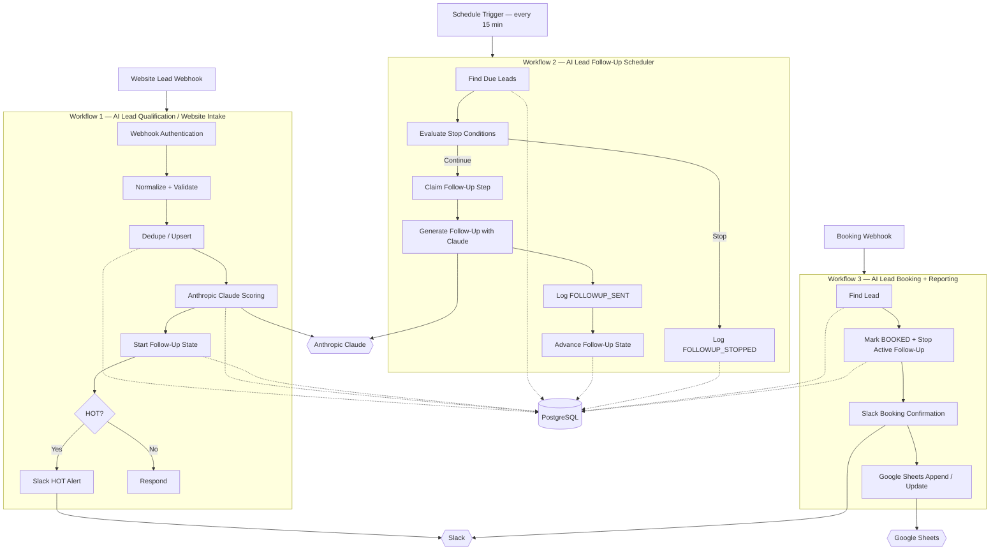

# 🚀 AI Lead Qualification & Follow-Up Automation


Production-style AI lead qualification and follow-up automation built with **n8n, PostgreSQL, Anthropic Claude, Slack, and Google Sheets**.

The system receives website leads, validates and deduplicates them, scores them with Claude, assigns a deterministic lead temperature, initializes a database-backed follow-up sequence, stops follow-ups when a lead replies or books, sends high-value alerts to Slack, and synchronizes confirmed bookings to Google Sheets.

---
DEMO 🎥   https://www.loom.com/share/c1d4b874866348c997084fbcd1961851                   
---

## Final verification

- **668 automated tests**
- **667 passing**
- **1 expected skip**
- **0 failing**
- Three completed n8n workflows
- Real Anthropic Claude scoring verified
- Real Claude follow-up generation verified
- Real Slack HOT-lead alert verified
- Real Slack booking confirmation verified
- Real Google Sheets booking sync verified
- Scheduler advancement and stop conditions verified against live PostgreSQL
- Duplicate notification and booking idempotency verified
- Authentication, validation, human-review, booking, reply-stop, 404, and 401 paths verified

---

## Tech stack

| Layer | Implementation |
| --- | --- |
| Workflow automation | n8n, self-hosted with Docker |
| Database | PostgreSQL |
| AI / LLM | Anthropic Claude |
| HOT lead alerts | Slack |
| Booking notifications | Slack |
| Booking reporting | Google Sheets via n8n OAuth2 |
| Automated tests | Node.js built-in `node:test` |
| Runtime safety | `DRY_RUN`, database constraints, bounded retries, audit events |
| Business timezone | `America/Los_Angeles` |

---

# Architecture



---

# The three live n8n workflows

| # | Workflow | Trigger | Purpose |
| --- | --- | --- | --- |
| 1 | **AI Lead Qualification — Website Intake** | Webhook | Authentication, validation, dedupe, Claude scoring, follow-up initialization, HOT Slack alerts |
| 2 | **AI Lead Follow-Up Scheduler** | Every 15 minutes | Finds due leads, evaluates stop conditions, generates follow-up copy with Claude, records the step, advances state |
| 3 | **AI Lead Booking + Reporting** | Booking webhook | Marks leads booked, cancels active follow-ups, sends Slack confirmation, updates Google Sheets |

Detailed node-by-node documentation:

- `docs/workflow.md`
- `docs/scheduler.md`
- `docs/booking.md`
- `docs/security.md`

---

# Workflow 1 — Intake & AI Scoring

The website intake workflow:

1. receives a lead through a webhook
2. validates the shared webhook secret
3. normalizes and validates the payload
4. derives the dedupe identity
5. safely upserts the lead into PostgreSQL
6. writes audit events
7. builds a sanitized scoring prompt
8. calls Anthropic Claude
9. validates the returned score
10. retries malformed model output once with a stricter prompt
11. assigns `HOT`, `WARM`, or `COLD` deterministically
12. initializes follow-up state
13. sends a Slack alert for HOT leads when outbound sending is enabled

## Deterministic lead temperature

Claude returns the **score and reasoning**.

Claude does not choose the final temperature.

The application maps the score to:

```text
HOT
WARM
COLD
```

using deterministic business logic in:

```text
src/core/temperature.js
```

This prevents contradictory output such as:

```text
score: 30
temperature: HOT
```

---

# Workflow 2 — Follow-Up Scheduler

The scheduler runs every 15 minutes.

It queries PostgreSQL for leads whose follow-up is active and due, then:

- evaluates stop conditions
- claims the follow-up step idempotently
- builds a sanitized follow-up prompt
- generates follow-up copy using Anthropic Claude
- records `FOLLOWUP_SENT`
- advances `followup_step`
- sets `last_contacted_at`
- calculates the next allowed business-time follow-up
- or records `FOLLOWUP_STOPPED`

## Current delivery boundary

The scheduler **generates and records follow-up content**, but this portfolio implementation does not connect a real email or SMS delivery provider.

`FOLLOWUP_SENT` therefore represents the audited scheduler send step and generated message in the current implementation.

Adding an email/SMS provider would be an integration-layer extension; the scheduling and state-management logic already exists independently.

---

# Why follow-up state lives in PostgreSQL

The project does not keep one long-running workflow execution open for every lead.

Instead, follow-up state is persisted in PostgreSQL:

```text
followup_status
followup_step
next_followup_at
last_contacted_at
```

The scheduler polls that state every 15 minutes.

This makes follow-up behavior:

- queryable
- auditable
- restart-friendly
- easy to debug
- independent of one long-lived execution

---

# Workflow 3 — Booking & Reporting

The booking workflow:

1. authenticates the booking webhook
2. finds the existing lead
3. sets:
   - `booking_status = BOOKED`
   - `crm_status = BOOKED`
4. stops the follow-up sequence when it is currently `IN_PROGRESS`
5. clears `next_followup_at`
6. logs `BOOKING_RECEIVED`
7. logs `FOLLOWUP_STOPPED` when a running sequence was actually stopped
8. idempotently claims the booking confirmation
9. sends a Slack booking confirmation
10. appends or updates the booking in Google Sheets

This workflow was verified with both safe dry-run execution and a real outbound run.

The real outbound test produced:

```text
SLACK_ALERT_SENT = SUCCESS
SHEET_SYNCED      = SUCCESS
```

---

# PostgreSQL state & idempotency

Important duplicate guarantees are enforced by PostgreSQL rather than by timing-sensitive workflow checks.

## Lead deduplication

```text
leads.dedupe_key UNIQUE
```

Repeated submissions cannot create duplicate lead rows.

## Notification idempotency

```text
notifications (lead_id, kind, step) UNIQUE
```

This protects notification kinds including:

```text
SLACK_HOT
FOLLOWUP
BOOKING_CONFIRM
```

The live booking acceptance test confirmed that sending the same booking event again:

- created another `BOOKING_RECEIVED` audit event
- did not create a second `FOLLOWUP_STOPPED`
- did not send a duplicate booking Slack confirmation

## Audit trail

`lead_events` stores append-only workflow history.

Examples include:

```text
CRM_CREATED
AI_SCORE_CREATED
AI_SCORE_INVALID
FOLLOWUP_SENT
FOLLOWUP_STOPPED
BOOKING_RECEIVED
SLACK_ALERT_SENT
SHEET_SYNCED
WORKFLOW_ERROR
```

The acceptance tests query these events directly from PostgreSQL.

---

# Anthropic Claude

Anthropic Claude is the **actual LLM used by the completed live demo**.

Claude is used for:

- lead scoring
- scoring reasoning
- follow-up message generation

The live n8n workflows call Anthropic through HTTP Request nodes.

Model output is never blindly trusted.

Responses are passed through:

- sanitization
- schema/output validation
- score parsing
- deterministic temperature mapping
- failure handling
- human-review fallback

A malformed scoring response receives one stricter retry.

If scoring still fails, the lead remains persisted and is routed to:

```text
crm_status = HUMAN_REVIEW
needs_human_review = true
```

The lead is never silently discarded because an AI call failed.

---

# Retry & resilience

The project has two resilience layers.

## Source-level retry policy

```text
src/core/retry.js
```

contains deterministic bounded retry/backoff behavior for the source adapter/test path.

Transient failure categories include:

- timeout
- unreachable provider
- HTTP `429`
- HTTP `5xx`

Non-transient errors are not blindly retried.

The retry policy is bounded and cannot loop forever.

## Live n8n retry settings

During the M8 hardening pass, n8n `Retry On Fail` was enabled and verified on these external-call nodes:

```text
Claude Score
Claude Retry
Claude Follow-up
Send Booking Confirmation
Sync Booking to Sheet
```

Settings:

```text
Retry On Fail: ON
Max Tries: 3
Wait Between Tries: 1000 ms
On Error: Stop Workflow
```

These live n8n settings are separate from the source-level retry policy.

The project does **not** claim that a deliberate live network outage was injected to demonstrate these settings firing.

---

# DRY_RUN safety

The safe default is:

```text
DRY_RUN=true
```

Outbound Slack and Google Sheets actions can be skipped while the intended action remains visible in the audit trail.

Examples:

```text
SLACK_ALERT_SENT / SKIPPED
SHEET_SYNCED / SKIPPED
```

For the live booking acceptance test, `DRY_RUN` was temporarily changed to:

```text
false
```

A real Slack booking confirmation and a real Google Sheets write were successfully produced.

After verification, the environment was restored to:

```text
DRY_RUN=true
```

---

# Business timezone

The verified demo uses:

```text
BUSINESS_TZ=America/Los_Angeles
```

Follow-up times are clamped to the configured business window.

During live testing, a timezone configuration gap was discovered:

the n8n container had timezone-related variables but did not expose a variable literally named:

```text
BUSINESS_TZ
```

to Code nodes.

The fix added:

```yaml
BUSINESS_TZ: ${BUSINESS_TZ}
```

to the n8n service environment in `compose.yaml`.

After recreating the container, live verification produced:

```text
2026-08-31 16:00:00+00
```

which equals:

```text
09:00 America/Los_Angeles
```

for that date.

The corrected timezone behavior was verified through both:

```text
startFollowup
advanceFollowup
```

---

# Slack

Slack is used for two live notification paths.

## HOT lead alert

A verified HOT lead produced a real Slack alert containing:

```text
Name: Vako SlackTest
Company: Demo Automation LLC
Score: 88
Reasoning: ...
Recommended action: ...
```

The notification idempotency guard prevented duplicate HOT alert behavior during duplicate processing.

## Booking confirmation

A real booking test produced:

```text
📅 Vako SchedulerTest2 just booked a call — Demo Automation LLC
```

The booking confirmation is protected by the `BOOKING_CONFIRM` notification claim.

---

# Google Sheets

Workflow 3 synchronizes booked leads into:

```text
AI Lead Bookings
```

using n8n's built-in Google Sheets node and OAuth2.

Verified columns:

```text
lead_id
first_name
last_name
email
company
booking_status
crm_status
```

Operation:

```text
Append or Update Row
```

Matching column:

```text
lead_id
```

A real booking was successfully written to the Sheet during the live acceptance test.

---

# Authentication & security

Every inbound webhook requires:

```text
X-Lead-Token
```

validated against:

```text
WEBHOOK_SECRET
```

The final project includes:

- constant-time shared-secret validation
- input validation
- untrusted-input sanitization
- prompt-injection heuristics
- explicit prompt delimiters
- constrained LLM output parsing
- bounded retries
- database uniqueness constraints
- audit logging
- `.env` excluded from Git
- no committed runtime secret values

Prompt-injection detection is used as a **risk signal**, not as a reason to silently throw a real lead away.

See:

```text
docs/security.md
```

---

# Setup

## Requirements

- Node.js 20+
- Docker Desktop
- Anthropic API key
- Slack webhook for live alert testing
- Google account / OAuth credential for live Google Sheets testing

## Environment

Create:

```text
.env
```

from:

```text
.env.example
```

Never commit `.env`.

## Start the stack

```bash
docker compose up -d
```

n8n:

```text
http://localhost:5679
```

PostgreSQL schema and indexes are initialized from:

```text
db/001_schema.sql
db/002_indexes.sql
```

---

# Automated tests

Run:

```bash
npm test
```

Final verified result:

```text
tests       668
pass        667
fail        0
cancelled   0
skipped     1
```

The skipped test is an optional external hosted-parity path requiring additional configuration.

The normal test suite does not make live Anthropic, Slack, or Google Sheets calls.

---

# Repository structure

```text
src/core/       dependency-free business logic
src/adapters/   LLM and database I/O adapters
db/             PostgreSQL schema and indexes
tests/          automated tests
fixtures/       test fixtures
dist/nodes/     generated n8n Code-node snippets
docs/           workflow, scheduler, booking, security documentation
compose.yaml    local n8n + PostgreSQL runtime
```

`src/core/` is dependency-free.

`dist/nodes/` is generated from the source modules:

```bash
npm run build:nodes
```

Generated snippets should not be edited manually.

The repository intentionally does not contain exported n8n workflow JSON.

The three workflows were built manually from the node-by-node documentation.

---

# Verified live behavior

## Intake workflow

Verified live:

- webhook authentication
- validation
- lead creation
- duplicate handling
- Anthropic Claude scoring
- HOT/WARM handling
- AI failure → human review
- real HOT Slack alert
- follow-up initialization
- business-time calculation

## Scheduler

A due lead advanced:

```text
followup_step: 0 → 1
```

and produced exactly one:

```text
FOLLOWUP_SENT
```

An immediate second scheduler run did not resend it.

When:

```text
replied_at != NULL
```

the scheduler changed the lead to:

```text
followup_status = STOPPED
next_followup_at = NULL
```

and logged:

```text
FOLLOWUP_STOPPED
reason = lead_replied
```

without generating the next follow-up step.

## Booking

A booking on an active sequence produced:

```text
booking_status   = BOOKED
crm_status       = BOOKED
followup_status  = STOPPED
next_followup_at = NULL
```

and logged:

```text
BOOKING_RECEIVED
FOLLOWUP_STOPPED
```

with:

```text
reason = booking_confirmed
```

A repeat booking event did not duplicate the stop event or Slack confirmation.

A lead whose follow-up status was `PENDING` remained `PENDING`, because no active sequence existed to stop.

An unknown lead correctly returned:

```text
404
{"error":"lead_not_found"}
```

and logged:

```text
WORKFLOW_ERROR
```

after the `Find Lead by ID` node was corrected to use n8n's:

```text
Always Output Data
```

setting.

A request with an invalid token correctly returned:

```text
401
{"error":"unauthorized"}
```

---

# Project limitations

The current implementation intentionally does not claim features that were not built live.

Current boundaries:

- website webhook is the live intake trigger
- Meta/email source normalization exists in the codebase, but dedicated live triggers were not built
- follow-up text is generated and audited, but no email/SMS delivery provider is connected
- n8n retry settings were configured, but a deliberate live network failure was not injected
- Semgrep was not installed or run
- Loom recording remains a presentation task

---

# Demo walkthrough

A strong portfolio demo can show:

1. the three n8n workflows
2. a website lead entering Workflow 1
3. Anthropic Claude scoring and reasoning
4. the PostgreSQL lead state
5. the audit-event history
6. the real HOT Slack alert
7. duplicate submission behavior
8. database-backed follow-up scheduling
9. reply-stop behavior
10. booking-stop behavior
11. real booking Slack confirmation
12. real Google Sheets row
13. final automated tests

The strongest engineering points are:

**database-backed idempotency**

and

**database-backed follow-up scheduling**.

---

# Project status

**M0–M9 complete.**

The completed project includes:

- three live n8n workflows
- PostgreSQL state and audit storage
- Anthropic Claude scoring
- Claude follow-up generation
- Slack HOT alerts
- Slack booking confirmations
- Google Sheets booking reporting
- deterministic follow-up scheduling
- duplicate protection
- security controls
- bounded resilience behavior
- comprehensive automated testing
- final documentation

Remaining work is presentation-only: README screenshots, optional Loom recording, and any future external channel integrations.
