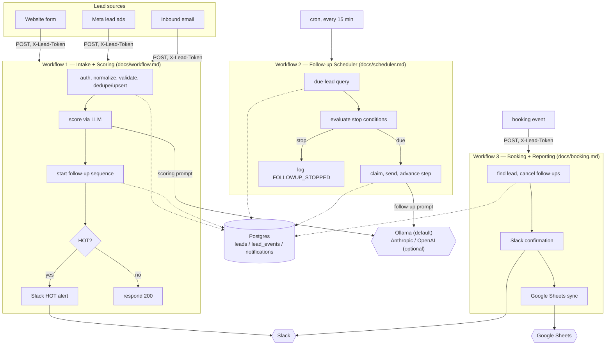

# lead-engine

AI lead qualification and follow-up automation, built on n8n.

Leads arrive from three sources, get scored by an LLM, land in a CRM, and enter a
deterministic follow-up sequence that stops when it should. Duplicate submissions
cannot create duplicate rows or duplicate messages — that guarantee is enforced by
the database, not by workflow logic. A booking cancels the sequence and reports
to Slack and a Google Sheet. Every external call is bounded and retried; nothing
hangs forever.

> **Status: M0–M9 complete — the full milestone plan (`PROJECT_SPEC.md` §9) has
> shipped.** This README is now the full documentation M9 calls for. The
> three live n8n canvases, their node-by-node build guides, and their
> acceptance-test walkthroughs are unchanged by this milestone —
> `docs/workflow.md`, `docs/scheduler.md`, `docs/booking.md`. `docs/security.md`
> is new: the consolidated security reasoning spec 4.2 asks for. **668 tests,
> 667 passing, 1 skipped** (the M2 hosted-parity marker, which only runs
> against a configured Postgres/PostgREST endpoint), **0 failing** — the
> count M8 left it at; M9 added no code, so it is unchanged. `dist/nodes/`
> was confirmed current against `src/core/` (`npm run build:nodes` produced
> no diff). See [Verified vs. manual](#verified-vs-manual) below for exactly
> what real-stack testing happened this session versus what a demo recording
> still requires by hand.

---

## The $0 default stack

Everything below runs locally with no paid API and no hosted service.

| Concern | Default | Cost |
|---|---|---|
| Workflow runtime | n8n, local or self-hosted (`compose.yaml`) | free |
| LLM | Ollama + `qwen2.5:7b-instruct` | free |
| Persistence | `mockCrm.js` (tests) / local Postgres (`compose.yaml`) | free |
| Outbound sends | `DRY_RUN=true` — logged, never sent | free |

Optional upgrades, each **configuration-only** — none of them touch
`src/core/`, prompts, generated Code-node snippets, workflow topology, or the
database schema:

| Upgrade | Set | Needs |
|---|---|---|
| Hosted Postgres | `CRM_ADAPTER=supabase`, `SUPABASE_URL`, `SUPABASE_SERVICE_KEY` | Supabase Free project |
| Hosted LLM | `LLM_PROVIDER=anthropic` or `openai`, that provider's key/model | an API key (billed) |
| Slack alerts | `SLACK_WEBHOOK_URL` | a free Slack workspace, an Incoming Webhook |
| Sheet reporting | `GOOGLE_SHEET_ID` + a Google Sheets credential **in n8n itself** | a normal Google account |

---

## Requirements

- Node.js ≥ 20 (uses the built-in `node --test` runner — the project has
  **zero npm dependencies**, production or dev).
- Docker, to run n8n + Postgres locally via `compose.yaml` — the same $0
  stack this project was built and demoed against.
- Ollama, for a live scoring call. The automated test suite scores against
  recorded fixtures and needs no LLM running at all — see
  `src/adapters/llm/llmInterface.md`.
- PostgreSQL 13+ *or* a Supabase Free project, only for the hosted-parity
  half of the test suite or a hosted demo — see `src/adapters/crmInterface.md`.

### Hardware / model sizing (Ollama)

`qwen2.5:7b-instruct` (the default) is a 7-billion-parameter model, roughly
4–5 GB on disk at its default quantization. As a rough guide:

- **8 GB+ RAM, CPU only:** runs, but scoring a single lead can take tens of
  seconds. Fine for development and a recorded demo; not for a busy
  production queue.
- **A GPU with 6 GB+ VRAM, or 16 GB+ unified memory (Apple Silicon):**
  comfortably fast for interactive use.
- **Constrained machines:** set `OLLAMA_MODEL` to a smaller instruct model
  (e.g. a 3B-class model) — this is a config-only change. Scoring accuracy on
  the rubric may be less consistent than the 7B default, but nothing else in
  the pipeline changes: the same prompt, the same parser, the same retry and
  human-review path apply regardless of model size (spec 5.0).

None of this applies if `LLM_PROVIDER` is switched to a hosted provider —
there is no local model to size.

---

## Setup

```bash
cp .env.example .env        # defaults already describe the $0 path
npm test                    # no install step; there are no dependencies
```

`npm test` is offline and free: it runs against `mockCrm.js` and recorded LLM
fixtures — no Postgres, no Ollama, no network call, needed. Setting
`SUPABASE_URL` additionally runs the identical CRM contract suite against
`supabaseCrm.js`, and setting `ANTHROPIC_API_KEY`/`OPENAI_API_KEY` does *not*
change what the LLM test suite does — those tests always run against
recorded fixtures with `fetch` stubbed out, never a real key.

### Running the live stack (n8n + Postgres, the same $0 path this project was demoed against)

```bash
docker compose up -d        # starts postgres (schema auto-applied) and n8n
```

`compose.yaml` applies `db/001_schema.sql` and `db/002_indexes.sql`
automatically on first start (Postgres's own `docker-entrypoint-initdb.d`
mechanism) and forwards every variable in `.env` — including `BUSINESS_TZ`,
which n8n's Code nodes read via `$env.BUSINESS_TZ` and which must be set
explicitly here, not inferred from the container's own `TZ`/`GENERIC_TIMEZONE`
(see [Timezone behavior](#timezone-behavior) below — this exact gap was
found and fixed live this session).

n8n is then reachable at `http://localhost:5679`. Build the three canvases
by hand there, following the three guides below — this project's whole
design (section 0) is "n8n is a GUI tool the agent cannot click; the human
builds the canvas."

Applying the schema directly, without Compose:

```bash
psql "$DATABASE_URL" -v ON_ERROR_STOP=1 -f db/001_schema.sql
psql "$DATABASE_URL" -v ON_ERROR_STOP=1 -f db/002_indexes.sql
```

Both files are re-runnable — every object is created `IF NOT EXISTS`, so
re-applying them to an existing database is a no-op that preserves data.

---

## Architecture

Business logic lives **inside n8n Code nodes**, not in an external service —
a portfolio piece for n8n work has to show the canvas doing real work, not
proxying to an API. Because a Code node cannot `require()` a local file,
every module in `src/core/` is a plain function with **zero imports**, and
`npm run build:nodes` concatenates each into a self-contained, paste-ready
snippet in `dist/nodes/`. Tests import `src/core/` directly; `src/core/` is
the source of truth, `dist/nodes/` is generated and must never be hand-edited
(`tests/build-nodes.test.js` fails the moment they drift apart).



Three **separate** n8n workflows, on purpose (spec 6.1): an inbound webhook's
request/response lifecycle, a cron tick's batch lifecycle, and a second,
independent webhook's lifecycle do not share one execution. No workflow here
uses an n8n `Wait` node — a `Wait` holds an execution open, does not survive
an n8n restart, and is invisible to the database. State lives in Postgres;
executions stay short and queryable.

### The three live n8n workflows

| # | Workflow | Guide | Trigger | What it does |
|---|---|---|---|---|
| 1 | Intake + Scoring | `docs/workflow.md` | Webhook (website form; Meta and email share the same normalization layer, spec 7) | Authenticates, normalizes, validates, dedupes/upserts, scores via LLM, starts the follow-up sequence, alerts Slack if `HOT` |
| 2 | Follow-up Scheduler | `docs/scheduler.md` | Cron, every 15 minutes | Finds due leads, claims each send idempotently, generates the message, advances the step, or stops the sequence |
| 3 | Booking + Reporting | `docs/booking.md` | Webhook (a booking event) | Cancels a lead's follow-ups, sends a Slack confirmation, syncs a Google Sheet row |

Each guide is the node-by-node build instructions **and** a manual
acceptance-test walkthrough proving that milestone's literal "done when"
sentence against the real stack — not just against `mockCrm`.

### Design decisions worth pointing at

**Temperature is derived, never returned by the model.** The LLM returns a
score; `src/core/temperature.js` maps it to `HOT`/`WARM`/`COLD`. Letting the
model return both invites contradictions like `score: 30, temperature: HOT`.

**No `Wait` node, anywhere.** Every one of the three workflows writes state to
Postgres and exits; the scheduler is what polls. See `docs/scheduler.md`'s
own reasoning (spec 6.1) — it is, in the project's own words, "the single
strongest engineering signal in the project."

**Retry is bounded, everywhere, at two different layers (spec 9, M8).** A
malformed LLM *answer* gets one retry with a stricter prompt (spec 5.3). A
transient *transport* failure — timeout, unreachable, a 5xx — gets its own
bounded retry with backoff: `src/core/retry.js`'s deterministic policy inside
the code path the automated suite exercises (`scoreLead()`), and n8n's own
per-node `Retry On Fail` setting (`Max Tries 3`, `Wait 1000ms`, `On Error:
Stop Workflow`) on the live canvases' real external-call nodes — verified
present on all five: `Claude Score`, `Claude Retry` (`docs/workflow.md`),
`Claude Follow-up` (`docs/scheduler.md`), `Send Booking Confirmation`,
`Sync Booking to Sheet` (`docs/booking.md`). These are two independent
mechanisms, not one duplicated — the code-level policy is not reachable from
any live canvas node (no Code node calls `scoreLead.js`; every canvas talks
to its provider over a raw HTTP Request/Slack/Sheets node instead), and the
node-level setting is not unit-tested. Neither replaces the other.

### Layout

```
src/core/       pure, dependency-free, unit-tested business logic (12 modules)
src/adapters/   CRM and LLM adapters — the only place I/O is allowed
db/             schema and index migrations
tests/          node --test suites
fixtures/       raw source payloads, LLM response envelopes, and scenario leads
dist/nodes/     generated Code-node snippets — never edit by hand
docs/           workflow.md, scheduler.md, booking.md, security.md
compose.yaml    local n8n + Postgres, the $0 demo stack
```

There is no `n8n/workflows/` directory of exported workflow JSON — that line
existed in an earlier draft of this file but was never how this project
works and has been removed. The three canvases are **built by hand** in n8n,
following `docs/workflow.md`/`scheduler.md`/`booking.md`; those guides are
the canvas specification, not a JSON export.

---

## Key behaviors

### Postgres state and idempotency

Nothing here relies on an in-memory flag or a workflow-level check for
"has this already happened" — every such guarantee is a database
constraint, checked concurrently:

- `leads.dedupe_key UNIQUE` — the same submission, fired twice (even racing),
  cannot create two rows. A duplicate merges into the existing row
  (`src/core/dedupe.js`) rather than re-scoring or re-alerting.
- `notifications (lead_id, kind, step) UNIQUE` — a `SLACK_HOT` alert, a
  `FOLLOWUP` step, or a `BOOKING_CONFIRM` cannot be sent twice. The pattern
  everywhere: attempt the insert; a constraint violation means it already
  went out, so skip.
- `lead_events` is an append-only audit log — every state change is logged,
  and it is queryable directly (`SELECT ... FROM lead_events WHERE ...`),
  which is what every acceptance-test walkthrough in `docs/*.md` actually
  checks against, not a UI.

Full reasoning: `docs/security.md` §4.

### `DRY_RUN`

`DRY_RUN=true` (the default) logs every outbound message — Slack alerts,
booking confirmations — instead of sending them
(`SLACK_ALERT_SENT`/`SKIPPED`, `SHEET_SYNCED`/`SKIPPED`, with the message
text still in `details`, so a demo can show exactly what *would* have gone
out). Every outbound path in this project respects it. Flip it to `false`
deliberately, for one real send, then flip it back — never leave it `false`
by default.

### Provider selection

`LLM_PROVIDER` (`ollama` default, `anthropic`, `openai`) is read once, by
`src/adapters/llm/scoreLead.js`'s `createLlmProvider` for the automated
suite, and by a single HTTP Request node's URL/headers/body on the live
canvas (`docs/workflow.md` §2.11's "pointing this node at a hosted provider"
note). Switching providers changes **only** environment configuration — the
prompts, the generated snippets, the workflow topology, and the database
schema are identical whichever one answers. `tests/llm-adapters.test.js`
proves this by replaying one recorded result through all three adapters and
asserting a single identical validated value (spec 10, scenario 17).

### Timezone behavior

`BUSINESS_TZ` (an IANA zone, e.g. `America/Los_Angeles`) governs when a
follow-up may send: a computed time outside `09:00–18:00` in that zone moves
to `09:00` the next business day; weekend sends move to Monday
(`src/core/followup.js`'s `clampToBusinessHours`, spec 6.2).

**A real gap was found and fixed live this session, worth recording
precisely rather than glossing over:** `compose.yaml` originally derived
n8n's own `GENERIC_TIMEZONE`/`TZ` from `${BUSINESS_TZ}` but never forwarded
a variable literally named `BUSINESS_TZ` into the container — so
`$env.BUSINESS_TZ` inside a Code node was `undefined`, and a clamp computed
in UTC instead of the intended zone (`09:00 UTC` instead of `09:00
America/Los_Angeles`, confirmed by comparing two live test leads before and
after the fix). The fix was one line — `BUSINESS_TZ: ${BUSINESS_TZ}` added
to the n8n service's `environment:` block — followed by a container
recreate. Re-tested live afterward: a `HOT` lead's `next_followup_at`
correctly landed on `2026-08-31 16:00:00+00`, which is `09:00
America/Los_Angeles` in August (UTC−7).

### Slack

Two independent sends, both `DRY_RUN`-gated and both logged as
`SLACK_ALERT_SENT`: a `HOT`-lead alert from Workflow 1, and a booking
confirmation from Workflow 3, idempotency-guarded by the `notifications`
table's `BOOKING_CONFIRM` kind so a retried booking event cannot double-post.
Both are n8n's built-in Slack/HTTP node against `SLACK_WEBHOOK_URL` — there
is no Slack adapter in `src/adapters/`, because nothing in this project's
code talks to Slack; the canvas does.

### Google Sheets

Workflow 3 only. n8n's built-in Google Sheets node, using **the human's own
OAuth2 credential configured in n8n itself** — not a key in `process.env`
(section 0: creating credentials is not the agent's responsibility).
Operation **Append or update row**, keyed on `lead_id`, spreadsheet
`GOOGLE_SHEET_ID` — idempotent by construction (a repeat sync overwrites the
same row rather than appending a duplicate), which is a different guarantee
than the `notifications`-table claim Slack uses, and does not need that one:
re-writing identical values is harmless.

---

## Verified vs. manual

Two different kinds of evidence back this project, and conflating them would
overstate what is actually known:

**Automated and re-runnable, `npm test`, offline, `mockCrm`/recorded
fixtures:** every unit and behavioral-fidelity test, all 17 of spec section
10's scenarios (temperature bands, dedupe precedence, validation, low
confidence, booking/reply stop conditions, invalid-JSON-twice, prompt
injection, concurrent duplicate webhooks, provider unavailable/timeout,
cross-provider parity), and the retry-with-backoff policy's own unit tests.
**667 passing, 1 skipped, 0 failing, every run.**

**Verified live this session, against the real stack** (n8n, Postgres,
Slack, Google Sheets — not `mockCrm`, not fixtures), via direct webhook
calls and Postgres queries, not screenshots:

- **Workflow 1:** a `HOT` lead (Slack alert correctly `SKIPPED` under
  `DRY_RUN`), a `WARM` lead, and an AI-scoring-failure lead (correctly
  routed to `HUMAN_REVIEW` with the lead persisted). The `BUSINESS_TZ` gap
  above, found and fixed live.
- **Workflow 2:** a due lead correctly advanced exactly one step, logged
  `FOLLOWUP_SENT` exactly once; an immediate second run correctly sent
  nothing (idempotent); a recorded reply correctly stopped the sequence
  (`FOLLOWUP_STOPPED`, reason `lead_replied`) rather than sending the next
  step.
- **Workflow 3:** a mid-sequence booking correctly cancelled the sequence
  and logged both `BOOKING_RECEIVED` and `FOLLOWUP_STOPPED`; a repeat POST
  behaved idempotently (no duplicate stop-log, no duplicate Slack send, per
  the `notifications` claim); a real (non-dry-run) send produced an actual
  Slack message and an actual Sheet row (`SLACK_ALERT_SENT`/`SHEET_SYNCED`
  both `SUCCESS`); a `PENDING` (never-started) lead's booking correctly left
  `followup_status` alone; an unknown `lead_id` was found, live, to fall
  through to an empty `200` instead of the documented `404` — until n8n's
  **Always Output Data** setting was enabled on the lookup node, after which
  it correctly returned `404` — and a wrong token correctly returned `401`.

**Reported by the developer, not independently re-observed via a tool call
this session:** that `Retry On Fail` (`Max Tries 3`, `Wait 1000ms`, `On
Error: Stop Workflow`) is now enabled on all five real external-call nodes
across the three canvases. This project has no tool that reads an n8n
node's configuration back out to verify it directly (no n8n API access was
used); the setting is recorded in each canvas guide at the node in question
on the developer's word, not machine-checked. **Not yet demonstrated live,
by anyone, this session:** an actual failure — a dropped connection, a
provider timeout — being caught and retried by that setting in a running
execution. The setting is confirmed present; it has not been confirmed to
fire.

**Not yet done — manual steps a human still has to take, listed rather than
faked:**

- [ ] The screenshots section 11 asks for: full canvas (all three
      workflows), the AI scoring node's output, a `leads` database row, the
      Slack `HOT` alert, the scheduler workflow, the Google Sheet, and an
      audit-log (`lead_events`) query result.
- [ ] The Loom recording itself — the script below is written; nobody has
      recorded it.
- [ ] An actual live demonstration of a transport failure being retried by
      the n8n `Retry On Fail` setting (as opposed to the setting merely
      being present).
- [ ] Running Semgrep locally (spec 13.2) — not installed in this
      environment at any point in this project's history; treated as
      optional review evidence (spec 9), never a blocking acceptance
      criterion, and never installed without asking first.

---

## Demo script (Loom, 4 minutes — spec section 11, verbatim structure)

1. **The problem** (20s) — leads arrive from three places and go cold.
2. **Architecture diagram** (30s) — the Mermaid diagram above, or the live
   n8n canvas list.
3. **Submit a lead live, watch it execute** (45s) — the `curl`/`Invoke-RestMethod`
   example in `docs/workflow.md`, against the running canvas.
4. **Show the score and the reasoning** (30s) — the `leads` row's
   `lead_score`/`ai_reasoning`, or the AI scoring node's output in n8n.
5. **Show the database row and audit trail** (30s) — a `lead_events` query
   for that lead, in order.
6. **Slack alert** (15s) — flip `DRY_RUN=false` for this one send only.
7. **Submit the exact same lead again — nothing duplicates** (30s) — the
   duplicate-submission acceptance test in `docs/workflow.md` §5.
8. **Scheduler: state in the database, not a hanging `Wait` node** (30s) —
   show `next_followup_at`, explain why (`docs/scheduler.md`'s own
   reasoning).
9. **Show a failure path handled cleanly** (20s) — an AI-scoring failure
   (lead persists, flagged) or a booking on a `PENDING` lead.

Steps 7 and 8 are what the spec calls out as what separates this from every
other n8n demo — do not cut them for time.
